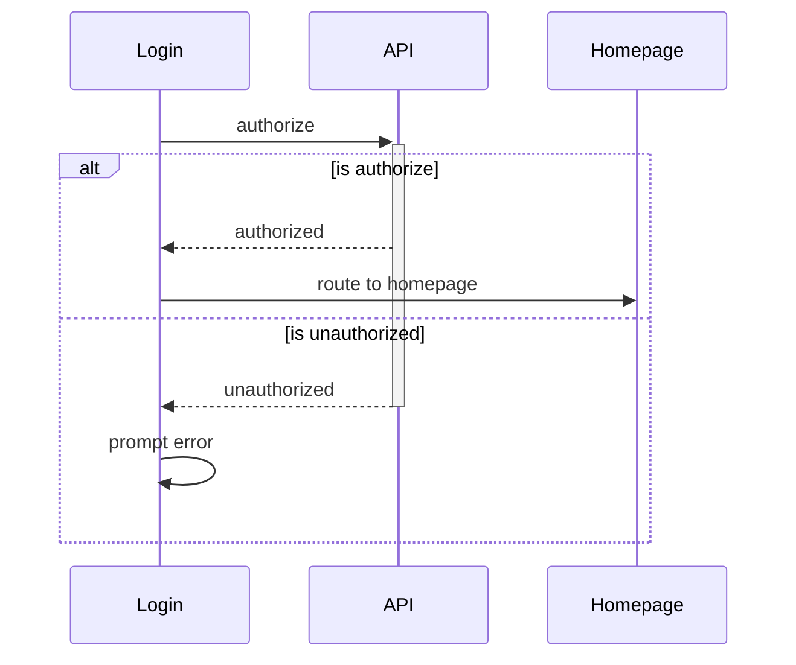
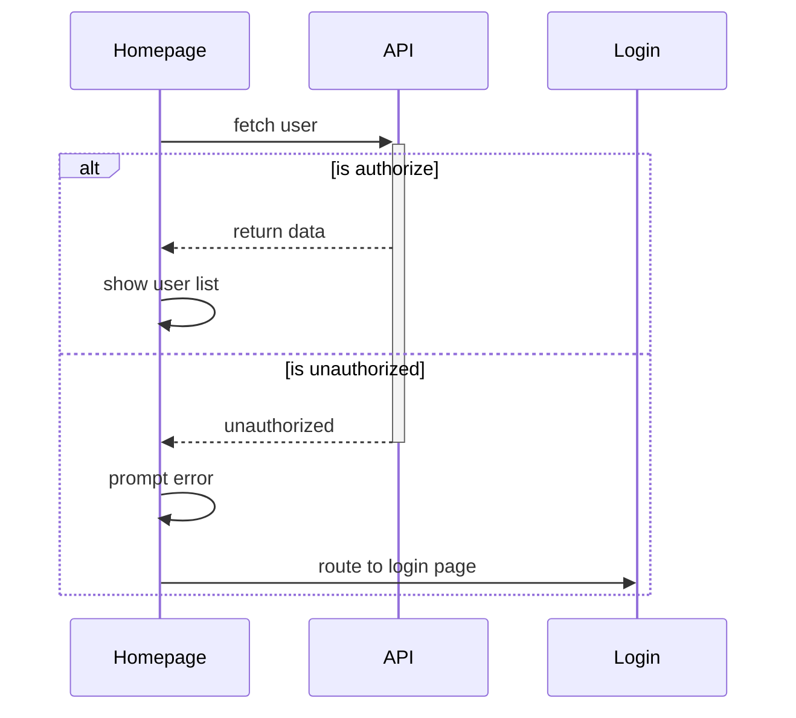
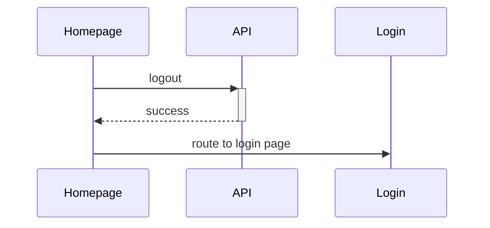

# Front End Assignment

build a customer portal which allows _customers to create an account_. It requires customer **to login** to the portal with a simple hardcoded username/password. The portal will **contain Header, Footer and body**. The header and footer are a **reusable component** that can be used by other front-end applications.

## pages

- [ ] login page
- [ ] home page

## reusable components

- [ ] header
- [ ] footer

## requirements

- [ ] implement fetch [user list API](https://reqres.in/api-docs/#/) in homepage
- [ ] implement _guard_ prevent unauthorized access to _home page_
- [ ] route success login to homepage
- [ ] implement reusable _menu links_ in _Header_ and _Footer_

# User Flow

## Authorization

## Fetch User

## Logout

